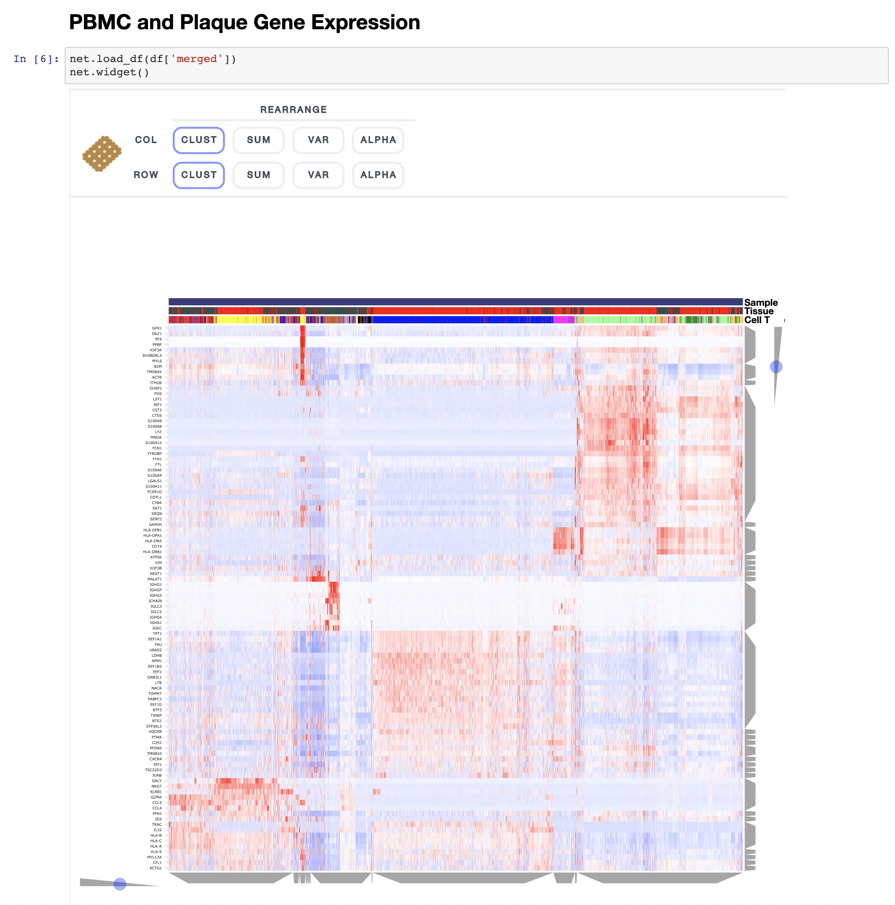

# Single Cell Immune Profiling of Atherosclerotic Plaques

This repository contains notebooks for interactively visualizing the single cell gene expression data from this study. The interactive visualizations are made using the single cell data analysis and visualization toolkit [Clustergrammer2](https://github.com/ismms-himc/clustergrammer2).

Immune Profiling of Atherosclerotic Plaques Identifies Innate and Adaptive Dysregulations Associated with Ischemic Cerebrovascular Events

Contact: https://www.mountsinai.org/profiles/chiara-giannarelli
