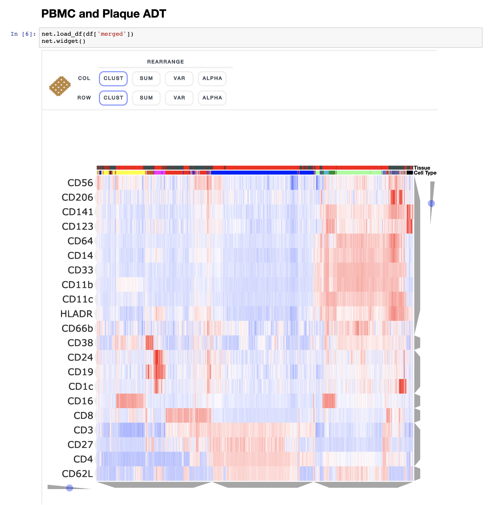
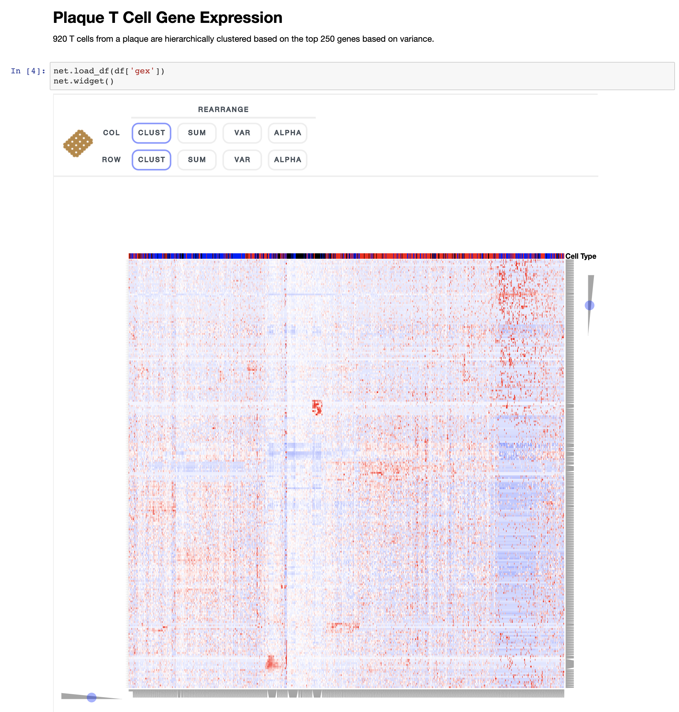
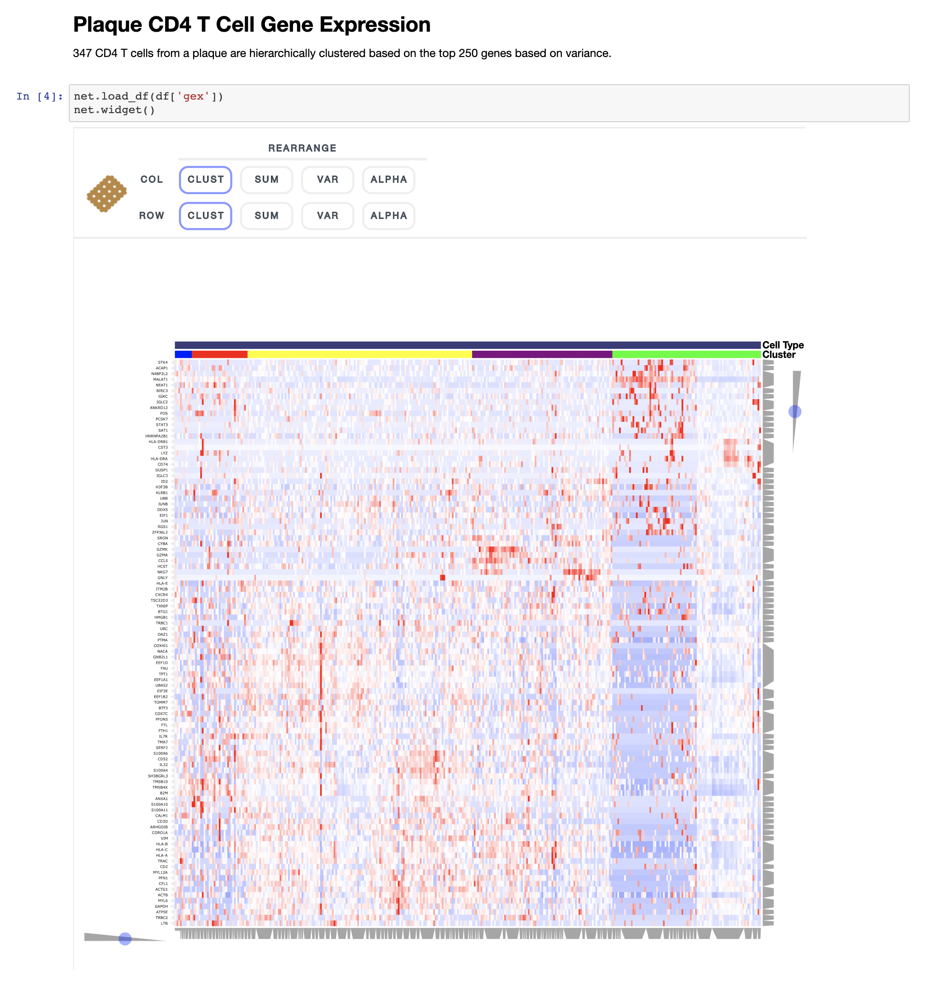
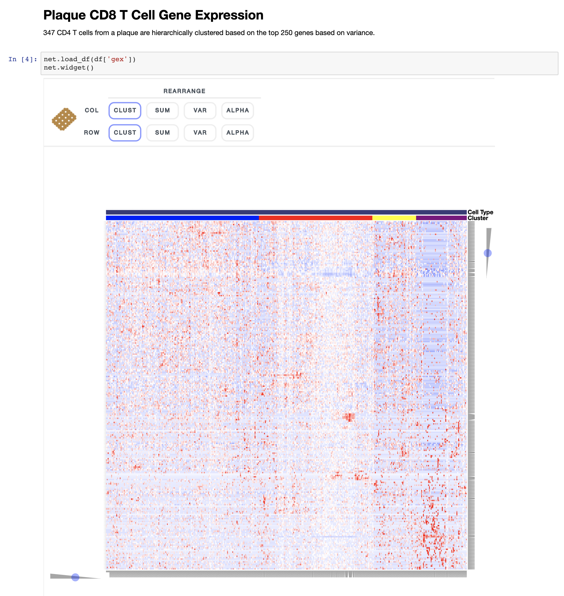

# Single Cell Immune Profiling of Atherosclerotic Plaques
This repository contains notebooks for interactively visualizing the single cell gene expression data from the study: **Immune Profiling of Atherosclerotic Plaques Identifies Innate and Adaptive  Dysregulations Associated with Ischemic Cerebrovascular Events (Fernandez et al.)**. The interactive visualizations are made using the single cell data analysis and visualization toolkit [Clustergrammer2](https://github.com/ismms-himc/clustergrammer2).

## Notebook Directory

### CITE-seq Sample
* [1.0 CITE-seq ADT PBMC and Plaque](#10-cite-seq-adt-pbmc-and-plaque)
* [1.1 CITE-seq GEX PBMC and Plaque](#11-cite-seq-gex-pbmc-and-plaque)
* [1.2 CITE-seq GEX Plaque: T Cells](#12-cite-seq-gex-plaque-t-cells)
* [1.3 CITE-seq GEX Plaque: CD4 T Cells](#13-cite-seq-gex-plaque-cd4-t-cells)
* [1.4 CITE-seq GEX Plaque: CD8 T Cells](#14-cite-seq-gex-plaque-cd8-t-cells)

### Sample Cohort scRNA-seq

## 1.0 CITE-seq ADT PBMC and Plaque

Single cell antibody derived tag data data was obtained from plaque and PBMC from the same subject. Cell type was assigned based on ADT surface marker expression.

## 1.1 CITE-seq GEX PBMC and Plaque

Single cell gene expression data data was obtained from plaque and PBMC from the same subject. Cell type was assigned based on ADT surface marker expression.

## 1.2 CITE-seq GEX Plaque: T Cells

Single cell gene expression data data was obtained from plaque and PBMC from the same subject. Cell type was assigned based on ADT surface marker expression.

## 1.3 CITE-seq GEX Plaque: CD4 T Cells

Single cell gene expression data data was obtained from plaque and PBMC from the same subject. Cell type was assigned based on ADT surface marker expression.

## 1.4 CITE-seq GEX Plaque: CD8 T Cells

Single cell gene expression data data was obtained from plaque and PBMC from the same subject. Cell type was assigned based on ADT surface marker expression.

Contact: https://www.mountsinai.org/profiles/chiara-giannarelli
