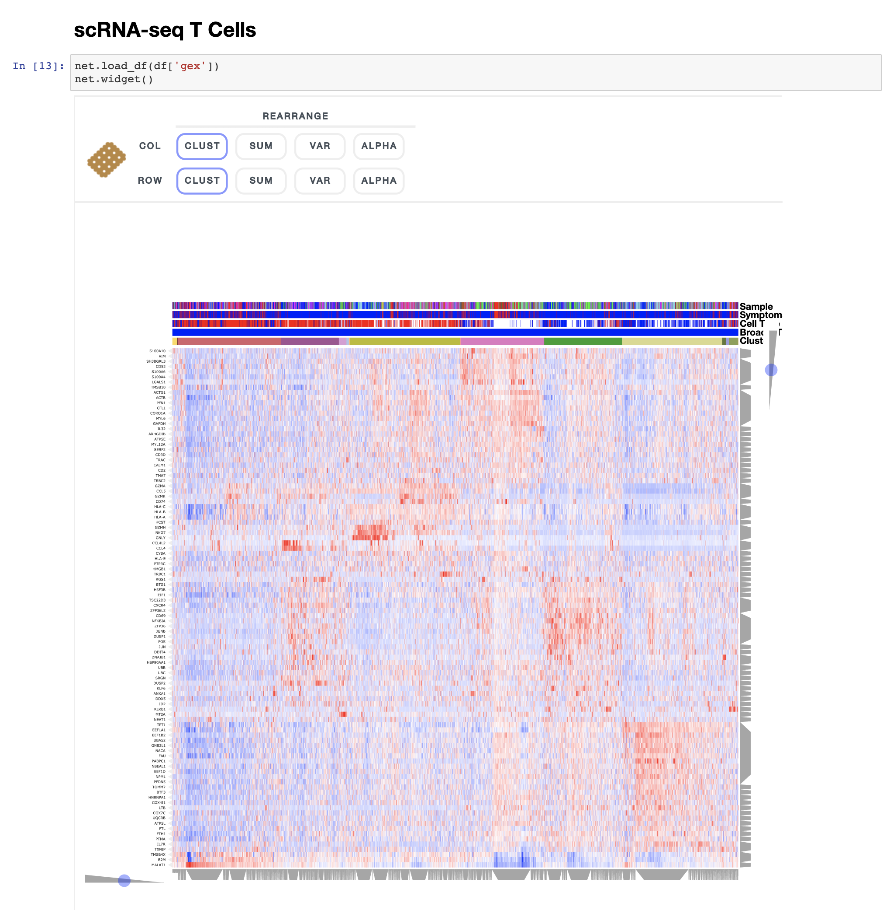
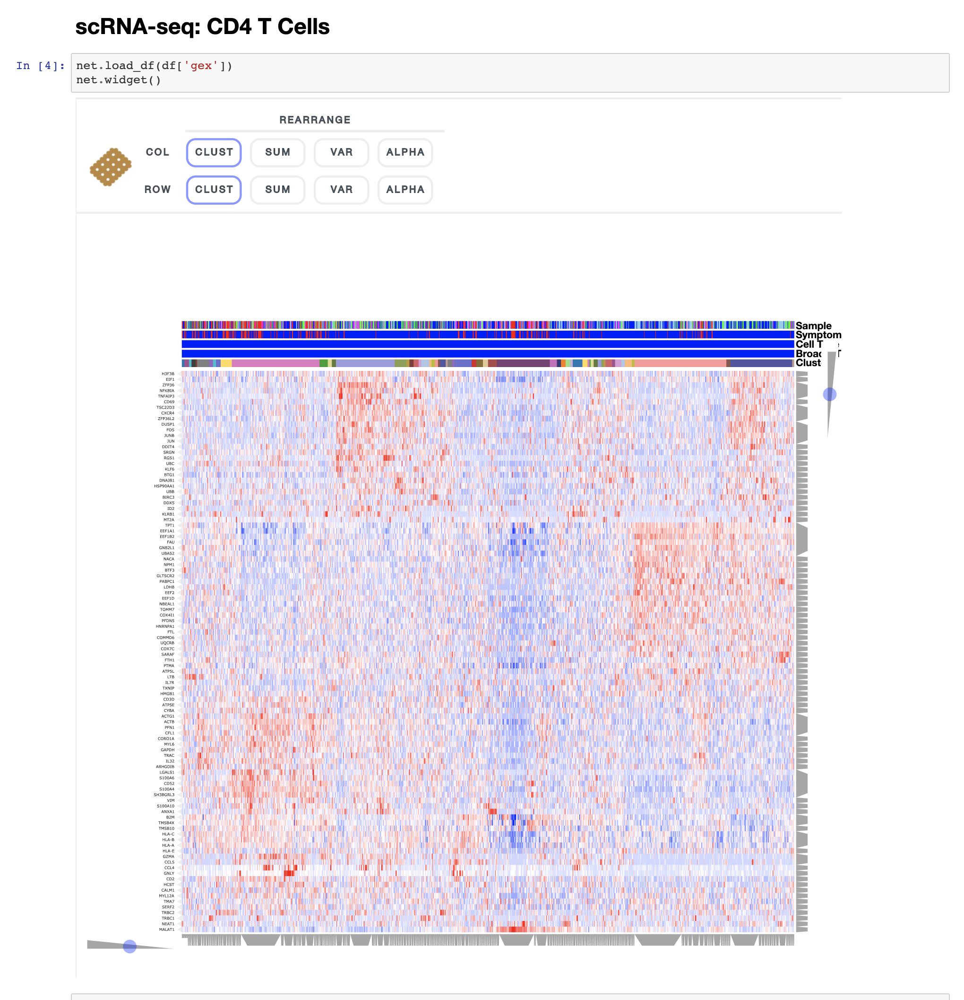
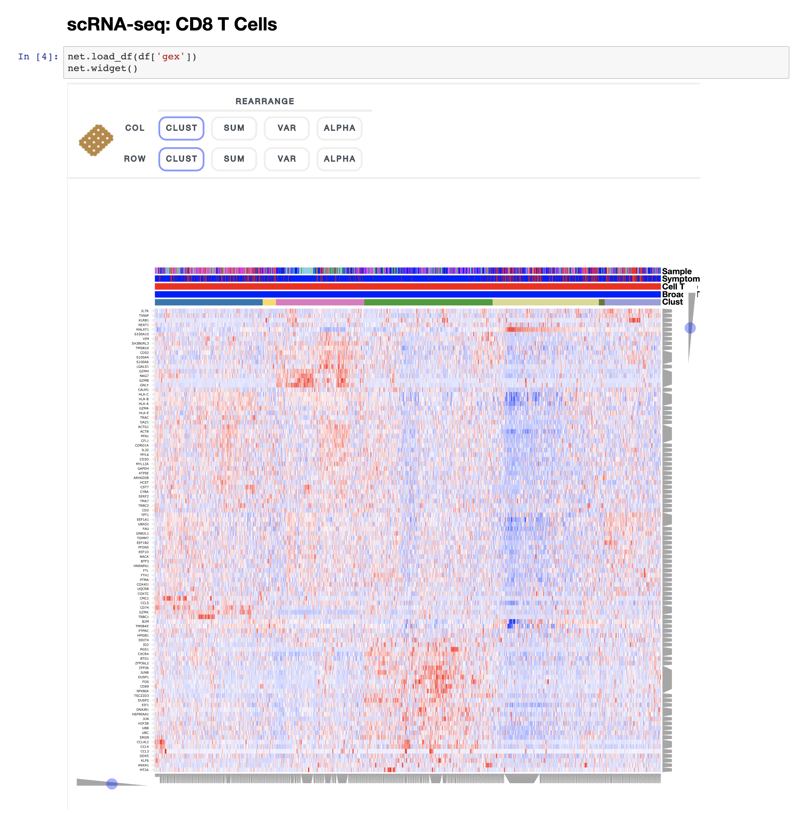
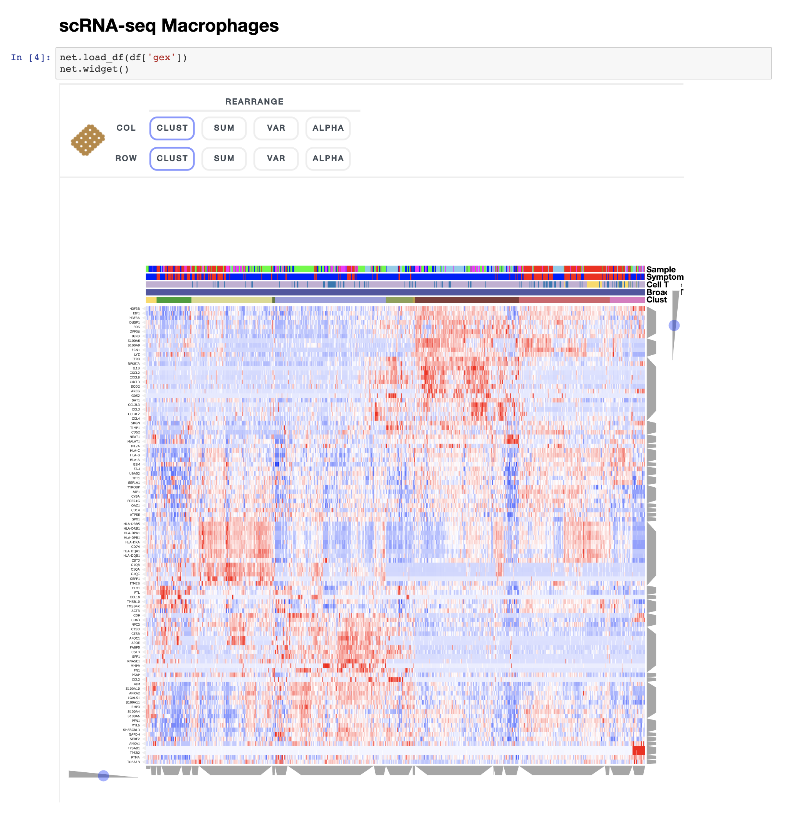
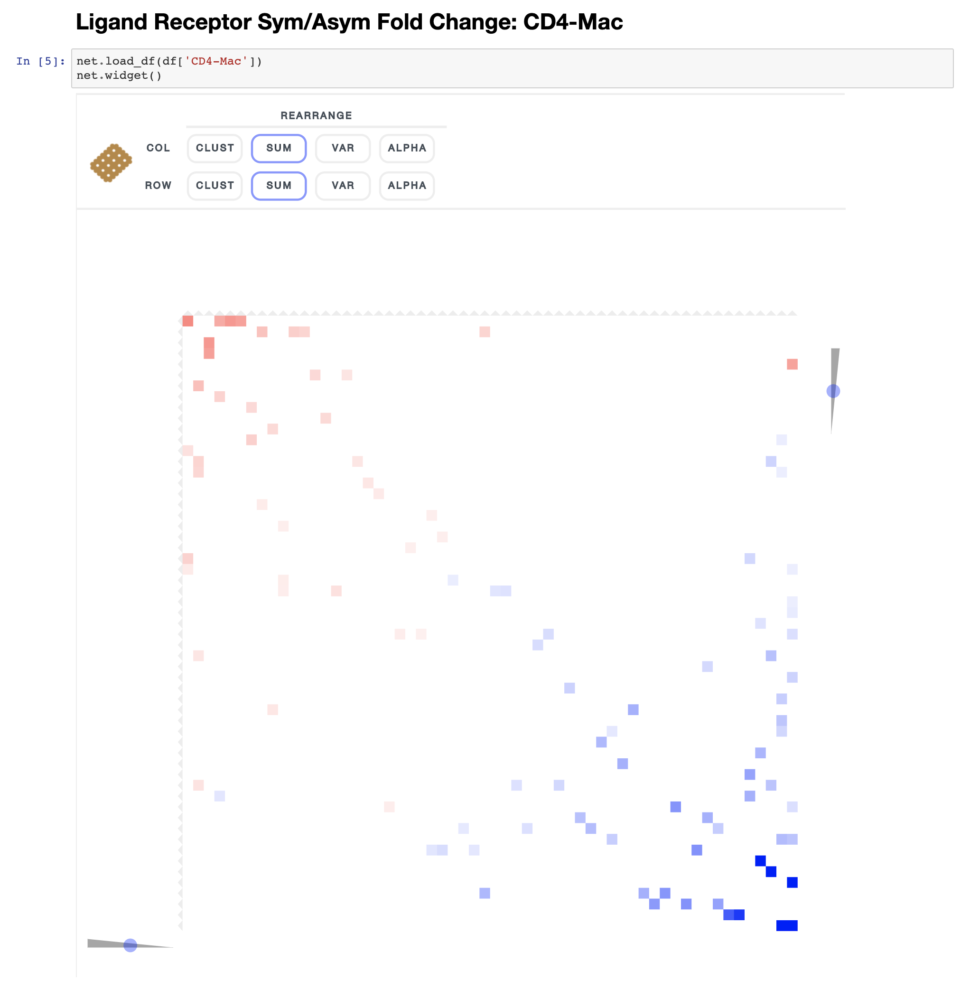

# Single Cell Immune Profiling of Atherosclerotic Plaques
This repository contains notebooks for interactively visualizing the single cell gene expression data from the study: **Immune Profiling of Atherosclerotic Plaques Identifies Innate and Adaptive  Dysregulations Associated with Ischemic Cerebrovascular Events (Fernandez et al.)**. The interactive visualizations are made using the single cell data analysis and visualization toolkit [Clustergrammer2](https://clustergrammer.readthedocs.io/) and work best using the Chrome browser.

### Notebook Directory

*CITE-seq Sample*
* [1.0 CITE-seq PBMC and Plaque: ADT](#10-cite-seq-pbmc-and-plaque-adt)
* [1.1 CITE-seq PBMC and Plaque: GEX](#11-cite-seq-pbmc-and-plaque-gex)
* [1.2 CITE-seq GEX Plaque: T Cells](#12-cite-seq-gex-plaque-t-cells)
* [1.3 CITE-seq GEX Plaque: CD4 T Cells](#13-cite-seq-gex-plaque-cd4-t-cells)
* [1.4 CITE-seq GEX Plaque: CD8 T Cells](#14-cite-seq-gex-plaque-cd8-t-cells)
* [1.5 CITE-seq GEX Plaque: Macrophages](#15-cite-seq-gex-plaque-macrophages)

*Sample Cohort scRNA-seq*
* [2.0 scRNA-seq GEX Cohort: T Cells](#20-scrna-seq-cohort-t-cells)
* [2.1 scRNA-seq GEX Cohort: CD4 T Cells](#21-scrna-seq-cohort-cd4-t-cells)
* [2.2 scRNA-seq GEX Cohort: CD8 T Cells](#22-scrna-seq-cohort-cd8-t-cells)
* [2.3 scRNA-seq GEX Cohort: Macrophages](#23-scrna-seq-cohort-macrophages)

*Ligand-Receptor Interaction Prediction*
* [3.0 Ligand-Receptor Sym-vs-Asym Differential Regulation](#30-ligand-receptor-sym-vs-asym-differential-regulation)

Click above notebook links to navigate to section and find NBViewer linkst to interactive notebooks.

## 1.0 CITE-seq PBMC and Plaque: ADT

Single cell antibody derived tag data data was obtained from plaque and PBMC from the same subject. Cell type was assigned based on ADT surface marker expression.

## 1.1 CITE-seq PBMC and Plaque: GEX

Single cell gene expression data data was obtained from plaque and PBMC from the same subject. Cell type was assigned based on ADT surface marker expression.

## 1.2 CITE-seq GEX Plaque: T Cells

Single cell gene expression data data was obtained from plaque and PBMC from the same subject. Cell type was assigned based on ADT surface marker expression.

## 1.3 CITE-seq GEX Plaque: CD4 T Cells

Single cell gene expression data data was obtained from plaque and PBMC from the same subject. Cell type was assigned based on ADT surface marker expression.

## 1.4 CITE-seq GEX Plaque: CD8 T Cells

Single cell gene expression data data was obtained from plaque and PBMC from the same subject. Cell type was assigned based on ADT surface marker expression.

## 1.5 CITE-seq GEX Plaque: Macrophages

Single cell gene expression data data was obtained from plaque and PBMC from the same subject. Cell type was assigned based on ADT surface marker expression.

## 2.0 scRNA-seq Cohort: T Cells

Single-cell gene expression data was obtained from atherosclerotic plaque samples from a cohort of six patients.

## 2.1 scRNA-seq Cohort: CD4 T Cells

Single-cell gene expression data was obtained from atherosclerotic plaque samples from a cohort of six patients.

## 2.2 scRNA-seq Cohort: CD8 T Cells

Single-cell gene expression data was obtained from atherosclerotic plaque samples from a cohort of six patients.

## 2.3 scRNA-seq Cohort: Macrophages

Single-cell gene expression data was obtained from atherosclerotic plaque samples from a cohort of six patients.

## 3.0 Ligand-Receptor Sym-vs-Asym Differential Regulation

Putative ligand-receptor interactions between cell types were predicted based on the product of ligand and receptor expression across pairs of cell types. Differentially regulated interactions across symptomatic vs asymptomatic plaques are shown in interactive heatmaps.

## Contact
https://www.mountsinai.org/profiles/chiara-giannarelli
